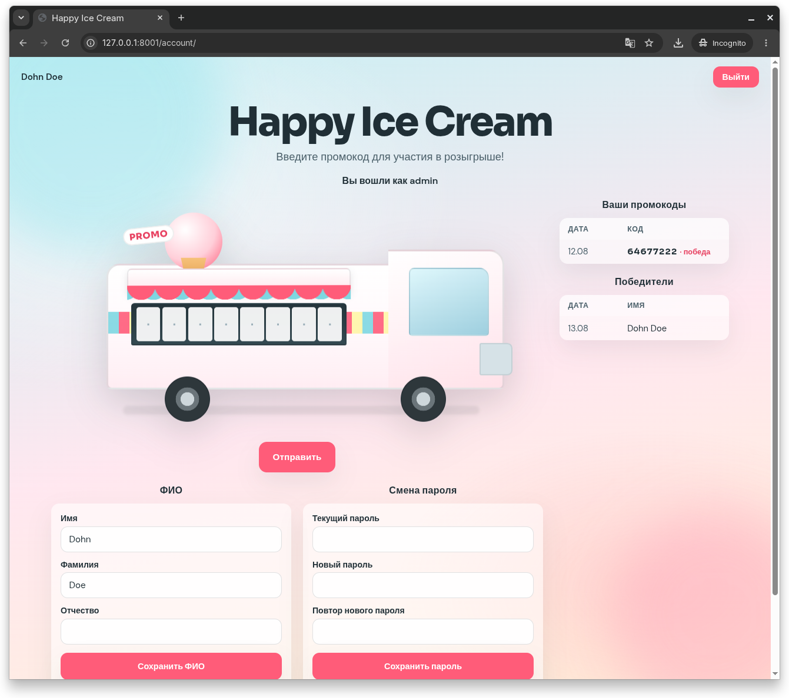

<p align="center">
  
</p>

# Happy Ice Cream

Демо-проект акции с промокодами: публичный лендинг, регистрация/вход, личный кабинет и ежедневный розыгрыш победителя.

## Возможности

- Лендинг `/`, вход `/login/`, регистрация `/signup/`
- Личный кабинет `/account/`: ввод промокода, список своих кодов, победители, ФИО, смена пароля, подписка на email
- Подтверждение email, восстановление пароля
- Ежедневный розыгрыш (Celery Beat, 12:00 UTC) по промокодам, введённым **вчера**
- Админка `/admin/`: генерация промокодов, импорт из Excel, ручной выбор победителя, `DailyDraw`

## Стек

| Компонент | Технология                          |
|-----------|-------------------------------------|
| Backend | Django 6, Django REST Framework     |
| БД | PostgreSQL 16 (или SQLite локально) |
| Очереди | Redis + Celery (celery + beat)      |
| HTTP | Gunicorn + WhiteNoise + nginx       |
| Почта | Resend (SMTP)                       |
| Контейнеры | Docker Compose                      |

Приложения в `src/`: `config`, `auth` (`user_auth.User`), `promocode`.

## Быстрый старт (Docker)

```bash
cp .env.example .env
docker compose up --build -d
```

| URL | Назначение |
|-----|------------|
| http://localhost:8000/ | приложение (`WEB_PORT` в `.env`) |
| http://localhost:8000/admin/ | админка |

При старте `web` выполняются `migrate` и `collectstatic`.

Суперпользователь:

```bash
docker compose exec web python manage.py createsuperuser
```

Логи / остановка:

```bash
docker compose logs -f web celery beat
docker compose down
```

### Сервисы Compose

| Сервис | Роль |
|--------|------|
| `web` | Gunicorn, внутри контейнера порт `8000` |
| `nginx` | reverse proxy, порт `80` |
| `db` | PostgreSQL |
| `redis` | брокер Celery |
| `celery` | worker |
| `beat` | расписание розыгрыша |

## Переменные окружения

Файл `.env` (шаблон — `.env.example`)

| Переменная | Назначение |
|------------|------------|
| `DJANGO_SECRET_KEY` | секрет Django |
| `DJANGO_DEBUG` | `1` / `0` |
| `DJANGO_ALLOWED_HOSTS` | хосты через запятую |
| `POSTGRES_HOST` | в Compose: `db`; локально: `localhost` |
| `POSTGRES_PORT` | порт **для приложения** (в Compose всегда `5432`) |
| `POSTGRES_PUBLISH_PORT` | порт Postgres **на хосте** (если `5432` занят — например `5433`) |
| `POSTGRES_DB` / `USER` / `PASSWORD` | доступ к БД |
| `CELERY_BROKER_URL` | в Compose: `redis://redis:6379/0` |
| `CELERY_RESULT_BACKEND` | в Compose: `redis://redis:6379/1` |
| `WEB_PORT` | порт приложения на хосте |
| `RESEND_API_KEY` | API-ключ Resend (если пусто — письма в консоль) |
| `DEFAULT_FROM_EMAIL` | отправитель, напр. `Happy Ice Cream <noreply@happy-ice-cream.com>` |
| `DJANGO_CSRF_TRUSTED_ORIGINS` | origins через запятую (`http://happy-ice-cream.com`, …) |

Без `POSTGRES_HOST` Django использует SQLite (`src/db.sqlite3`).

## Почта (Resend)

1. Домен должен быть верифицирован в [Resend](https://resend.com/domains).
2. В `.env` укажите `RESEND_API_KEY` и `DEFAULT_FROM_EMAIL` с адресом **вашего** домена (не `resend.dev`, если шлёте реальным пользователям).
3. Перезапустите `web` и `celery` (письма уходят и из HTTP-запросов, и из задач).

Проверка:

```bash
docker compose exec web python manage.py shell -c "
from django.core.mail import send_mail
send_mail('Test', 'Hello from Happy Ice Cream', None, ['YOUR_EMAIL@example.com'])
print('sent')
"
```

Если `RESEND_API_KEY` не задан, письма печатаются в логи `web`/`celery`.

## Локальный запуск без Compose

Нужны Python 3.13+ и (по желанию) PostgreSQL/Redis.

```bash
python -m venv .venv
source .venv/bin/activate
pip install -r requirements-dev.txt
cp .env.example .env
# для SQLite удалите или закомментируйте POSTGRES_HOST
# для локального Postgres/Redis: localhost и порты с хоста
cd src
python manage.py migrate
python manage.py runserver
```

Celery (из каталога `src/`):

```bash
celery -A config worker -l info
celery -A config beat -l info
```

## Структура

```
├── docker-compose.yml
├── Dockerfile
├── docker/entrypoint.sh
├── .env.example
├── requirements.txt
├── requirements-dev.txt
└── src/
    ├── manage.py
    ├── config/          # settings, urls, celery, tasks
    ├── auth/            # пользователи, сессии, профиль
    └── promocode/       # промокоды, кабинет, розыгрыш, админка
```

Статика приложений лежит в `*/static/`. `collectstatic` собирает файлы в `src/staticfiles/` (в git не коммитится); в Docker их отдаёт WhiteNoise.

## Разработка

```bash
pip install -r requirements-dev.txt
pre-commit install
ruff check src
```

## Лицензия

MIT © RedGradient
